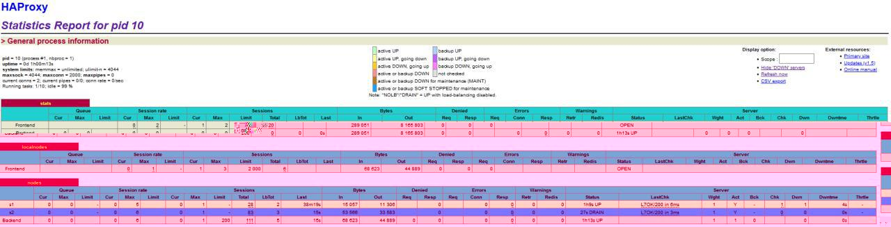

# Report for Lab 3 of AIT
### Authors : Mickael Bonjour & Miguel Gouveia

# Introduction
This lab will help us understand better some of the strategies of load balancing proposed by HAProxy. We will pass threw some options used to specify some behaviour in same balancing strategies.

# Task 1

### 1.
We can see that the proxy handles requests like this :
It will address the requests on each server sequentially. It means that one time it will be sent to one server and the next request coming will go threw the other server.
The NODESESSID is changing at each request which is not so surpirsing because each time we visit the site or actualize we have an ID which is invalid for the server requested (because the precendent response came from the other server). 
### 2. 
We expect the load balancer to address requests coming in with a session ID to the server who knows this session (so the server who created the session). If not, the session management can't be done.
### 3.
Here is our sequence diagram for task 1 (roundrobin). This sequence diagram shows 2 requests by the same user, we see that the behaviour is not correct because both requests don't go on the same server as expected.


That's because of the roundrobin strategy seen on the config file. This strategy consists to give a request to one server and the next to the next server. So in this case where it's a stateful ap (session dependant) it's anightmare because each time we mak a request we can go to another server than the previous request so our cookie will be reset (that's because the current server doesn't know the sessions of the previous server).

### 4.
Here is the test in JMeter, we can see that assertions are false because the counters doesn't increment, in fact th server don't know the users coming because of balancing strategy used here.


### 5.
Here we see the sequence diagram for this task, we can see that because there's only one server running it responds and knows each user (because he serves all the requests), and so the counter increments correctly.


Well, this one is a bit obvious, the load balancer detects a node down and doesn't forward any requests to it. So the session management don't have problems, but if there's too many users we will not be able to respond as well as the previous case.

We can see the JMeter report too :


## Task 2
### 1.
With SERVERID Cookie : 


With NODESESSID Cookie : 


We think that the SERVERID alternative is more effective because the balancer can just evaluate the SEVERID and redirect the request accordingly.
### 2.
We can see the modified configuration at the root of the git repo : `haproxy_sticky.cfg`. The modifications are juste on the `backend nodes` section. We've just added `cookie SERVERID insert indirect nocache` and the value we want to add on the cookie for each server so :
```
cookie SERVERID insert indirect nocache
server s1 ${WEBAPP_1_IP}:3000 cookie s1 check
server s2 ${WEBAPP_2_IP}:3000 cookie s2 check
```
### 3.
To see if we have achieved the right behaviour we can check like that :
First we visit the site and we see that the load balancer crete the SERVERID cookie and that if we refresh the page we keep the same server :


But if we open an incognito (to remove all cookies) we can see that the roundrobin strategy apply and we have the other server attribued :


And if we refresh this page we keep the same server again because the SERVERID cookie is well set.
### 4.
We can see here the diagram of the situation where 1 browser refresh the page and what happens if another browser opens a connection :


We can see that the SERVERID cookie is set at the HAProxy level, and it's removed at this level too. And because of the roundrobin if another browser connects to the infra it will be directed to s2 if s1 was the last to respond. This cookie is used by the HAProxy to redirect correctly to the right server.
### 5.
Here is the summary report of this task : 


We can explain the behaviour because how JMeter handles the cookies, because there's only one thread group and so one user. So that's normal that we just have one server who responds (because of the SERVERID Cookie).
### 7.
We can see the result of the manipulations we have done, in fact we added one "user". So the second user when doing his request he's redirected to the other server and all of these future requests will too (because of the cookie).


## Task 3

### 1.


We can see in the screenshot above that it is the node "s2" that answers.

### 2.



We pass the node "s2" on DRAIN mode, it become blue "soft stopped" on the state page.

### 3.


It's the same node than answer our request. In DRAIN mode, all the new traffic will be redirected to the other nodes, but the current sesssion continue to make request to the node in DRAIN mode.

### 4.


In the new browser , we start a new session and we reach the node "s1".

### 5.


We clear the cookies on the new browser and we still reach the node "s1". Because "s2" is DRAIN mode, the new session can't reach the "s2". The new browser can only reach "s1".


We refresh the first browser and it is still on the node "s2". But if we clear the cookie in the first browser, it will not be able to reach "s2" too.

### 6.


We pass "s2" on READY mode. On the state page, it becomes like at beginning.

It balanced sequentially between the two nodes.


We clear the cookies in the new browser and it reach the node "s2". If we clear again, it will change sequentially.


On the first browser, it still on the node "s2".

### 7.


We pass the node "s2" on MAINT mode, it become brown "down" on the state page.

On MAINT mode, all the traffic is redirected to the other nodes, including existing sessions. The node "s2" can't be reached by request.


The new browser reach the node "s1". If we clear the cookies, we still only reach "s1".


The first browser is not anymore on the node "s2". And has a new session on the node "s1".

## Task 4
### 1.
We have been asked to do a run for base data with the base config, so we set the delays to 0 for both servers (we took the JMeter conf. used for Task 2, 2 thread groups):


### 2.
We set a 250ms delay to s1 :


We can see with this run that it took a really long time (25min), but it works well in fact. What happens it's that the first user takes the connection to s1 and it will be long because the cookie specify s1 for each request. And the second user go to s2 without problems and takes each time s2 because of the cookie.
### 3.
Proof that we set correctly the delay :


We can see on the proof that HA detects s1 as DOWN.
We set a 2500ms delay to s1 :


We see that apparently the load balancer managd to see that the s1 server was too slow and directed all requests to s2 (see proof above). But that's really weird because this timeout for connecting to a server is defined as 5000ms.
### 4.
No we didn't have any error on these tasks, we think that the load balancer is smart enough to balance quite well, and we didn't make enough requests to cause an error.
### 5.
After doing the weight config:
```
server s1 ${WEBAPP_1_IP}:3000 cookie s1 check weight 2
server s2 ${WEBAPP_2_IP}:3000 cookie s2 check weight 1
```
We have this behaviour in the JMeter tests : 


Nothing change from the 2. apart of the time taken. That's because the weights doesn't change anything for 2 users.
### 6.
Now the weights takes effects because it's like we have another user each time, because we clean cookies for each iteration. So the weights influence the behaviour of the load balancer in this way :


## Task 5
### 1. 
We have choosen the first and leastconn strategies, because they seems interesting to us. In fact, the first strategy is interesting because it's used to only use one server for a certain amount of connection and shut down the oter servers in the farm (ecological for this times). 
### 2.
#### First
In the root folder you can see the haproxy_first.cfg which is the default config we used for the tests, but we will change maxconn values as indicated. 

So for this balancing strategy we need this config :
```
balance first
server s1 ${WEBAPP_1_IP}:3000 cookie s1 check maxconn 1
server s2 ${WEBAPP_2_IP}:3000 cookie s2 check
``` 
The maxconn 1 define 1 connection before it switches to the other server.
Like we see on this JMeter test both servers have one connection. 


In this screenshot we see one connection for each (because of 2 threads).
If we want to see better this strategy we put maxconn to 3 and 4 threads. But we lower the iterations to 100 for each thread. And we can see this behaviour :


With these parameters we can better see what's hapenning, it manages to have only 3 connections at a time. we can see that with the 300 requests to s1 and only 100 to s2, because s1 was already respondy to 3 different connections.

I've made tests with 10 threads but it's less obvious what happens because s1 take moe than 3 connections (because when the 100 iterations finish the connection is no more effective).

I think that's the best way to see really the impact. Maybe if you have a node that has better hardware than an other you can try this option to tweak the behaviour of your load balancing and go to mid-full capacity on the server you want not to overheat.

#### Leastconn
### 3.

## Conclusion
This lab was really interesting because HAProxy is really a complete tool for load balancing and it's interesting to see the optimizations we can do and that it's well used by profesionnals. And we learned many options of JMeter.
